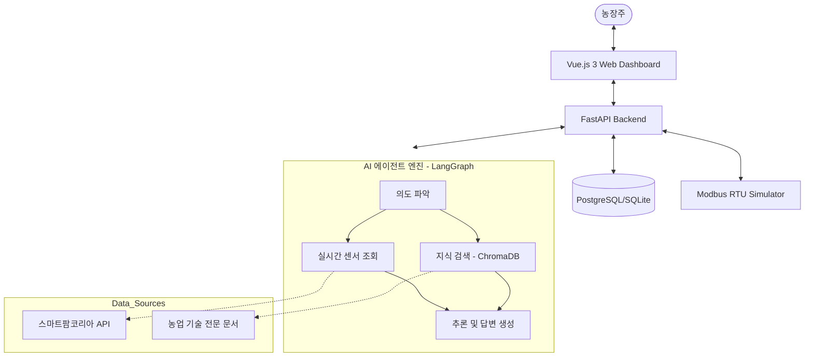

# Smart Farm Autonomous Agent (스마트팜 자율 관제 에이전트)

스마트팜 자율 관제 에이전트는 AI 에이전트 기술(LangGraph)과 실시간 IoT 환경 데이터를 결합하여, 온실 환경을 지능적으로 감시하고 자율적으로 제어하는 차세대 스마트팜 솔루션입니다.

## 1. 개발 배경 및 목표
### 배경
- **기후 변화와 인력 부족**: 급격한 기온 변화로 인한 작물 피해가 증가하고 있으나, 숙련된 농업 인력은 부족한 실정입니다.
- **복잡한 설비 운영**: 스마트팜 장비가 고도화됨에 따라 단순한 규칙(Rule-based) 제어를 넘어 작물의 생육 특성을 반영한 지능형 제어가 필요해졌습니다.

### 목표
- **자율 관제**: 작물 생육 한계점 돌파 시 인간의 개입 없이도 AI가 즉각적으로 최적의 제어 시퀀스를 실행합니다.
- **전문지식 기반 의사결정**: RAG(Retrieval-Augmented Generation)를 통해 검증된 농업 지식을 바탕으로 농장주의 질문에 답변하고 제어 로직을 생성합니다.
- **표준 기술 준수**: 국내 스마트팜 표준(KS X 3267) 기반의 Modbus RTU 프로토콜을 사용하여 실제 하드웨어 호환성을 확보합니다.

## 2. 주요 기능
- **🤖 LangGraph 기반 AI 에이전트**: 사용자의 복잡한 질의를 분석하고, 실시간 센서 데이터와 전문 지식 문서를 결합하여 답변을 생성합니다.
- **🚨 긴급 자율 개입**: 온실 온도가 35℃를 초과하거나 CO2 농도가 급락하는 등 위급 상황 발생 시 즉시 환풍기(Fan), 천창(Vent) 등을 자동 제어합니다.
- **📊 실시간 환경 모니터링**: 온도, 습도, CO2 데이터를 주기적으로 수집하고 대시보드를 통해 시각화합니다.
- **📜 마크다운 리포트 생성**: 최근 7일간의 환경 변화와 제어 이력을 분석하여 농업인용 '생육 리포트'와 설비업체용 '장비 점검 리포트'를 자동 생성합니다.
- **⚙️ 하드웨어 시뮬레이션**: 실제 하드웨어가 없어도 가상의 폭염 데이터를 주입하여 시스템의 대응 과정을 테스트할 수 있는 기능을 제공합니다.

## 3. 시스템 아키텍처

## 4. 기술 스택
### Backend
- **Core**: Python 3.10+, FastAPI
- **AI/LLM**: Google Gemini 2.5 Flash, LangChain, LangGraph
- **Database**: SQLAlchemy (ORM), ChromaDB (Vector Store), PostgreSQL
- **Protocol**: Modbus RTU (KS X 3267 표준 준수)

### Frontend
- **Framework**: Vue.js 3 (Composition API)
- **State Management**: Pinia
- **Build Tool**: Vite
- **Styling**: TailwindCSS

## 5. 트러블 슈팅 및 주요 해결 과제
- **API 안정성 확보**: 스마트팜코리아 공공 API의 간헐적 호출 실패에 대응하기 위해 **다중 날짜 재시도(Fallback)** 및 **캐시 로직**을 구현했습니다.
- **제어 시퀀스 검증**: AI가 생성한 제어 명령이 안전한지 확인하기 위해 **하드웨어 가드레일**을 설치하여 임계치를 벗어난 오작동을 방지했습니다.
- **인코딩 문제 해결**: Windows 환경의 CLI 출력 및 로그 기록 시 발생하는 UTF-8 인코딩 오류를 `sys.stdout.reconfigure` 및 예외 처리를 통해 안정화했습니다.

## 6. 향후 발전 방향
- **멀티 작물 지원**: 현재 토마토 중심의 제어 로직을 딸기, 파프리카 등 다양한 시설 원예 작물로 확장 예정입니다.
- **이미지 기반 병해충 진단**: Ultralytics YOLOv8을 활용하여 CCTV 영상을 분석, 병해충 발생 시 에이전트가 즉각 알림을 보내는 기능을 통합할 계획입니다.
- **Edge AI 배포**: 클라우드 의존도를 낮추기 위해 온디바이스(On-device) AI를 통한 오프라인 자율 제어 기능을 고도화할 예정입니다.

---

*본 프로젝트는 스마트팜의 자율성을 극대화하여 농업인의 삶의 질을 높이고 작물의 생산성을 최적화하는 것을 목표로 합니다.*
